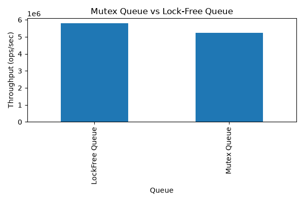

# Lock-Free MPMC Queue in C++

<p align="center">
  
</p>

<p align="center">
A bounded Multi-Producer Multi-Consumer (MPMC) queue implemented in C++17 using lock-free synchronization with atomic operations and Compare-And-Swap (CAS). The project includes correctness testing and performance benchmarking against a mutex-based implementation.
</p>

---

## Overview

Concurrent queues are widely used in systems such as task schedulers, thread pools, messaging systems, and networking software. Traditional implementations protect shared state using mutexes, which can introduce blocking and contention when many threads access the queue simultaneously.

This project implements a bounded lock-free MPMC queue using atomic operations and Compare-And-Swap (CAS), and evaluates its correctness and performance against a mutex-based queue.

---

## Features

* Lock-free bounded MPMC queue
* Circular buffer implementation
* Atomic Compare-And-Swap (CAS)
* Sequence-number based synchronization
* Acquire/Release memory ordering
* Mutex-based queue implementation for comparison
* Concurrent correctness testing
* Performance benchmarking and visualization

---

## Project Structure

```text
LockFreeQueue/
│
├── include/
│   ├── lockfree_queue.h
│   └── mutex_queue.h
│
├── src/
│   ├── correctness_test.cpp
│   └── benchmark.cpp
│
├── results/
│   ├── benchmark_results.csv
│   └── benchmark_results.png
│
├── results_plot.py
├── README.md
└── .gitignore
```

---

## Design

The queue uses a fixed-size circular buffer where each slot stores:

* the element
* an atomic sequence number

Instead of locking the queue, producers and consumers coordinate by atomically updating enqueue and dequeue positions using Compare-And-Swap (CAS).

### Why Sequence Numbers?

Since the circular buffer continuously reuses the same memory locations, enqueue and dequeue indices eventually wrap around. Sequence numbers allow each thread to determine whether a slot is:

* available for writing,
* contains valid data, or
* belongs to a previous cycle of the buffer.

This eliminates ambiguity without requiring locks.

---

## Queue Operations

### Enqueue

1. Read the current enqueue position.
2. Locate the corresponding buffer slot.
3. Verify the slot is available using its sequence number.
4. Reserve the position using CAS.
5. Write the value.
6. Publish the slot with a release store.

### Dequeue

1. Read the current dequeue position.
2. Locate the corresponding slot.
3. Verify that valid data is present.
4. Reserve the position using CAS.
5. Read the value.
6. Mark the slot reusable by updating its sequence number.

---

## Memory Ordering

Different atomic memory orders are used depending on the synchronization requirement.

| Memory Order           | Purpose                                             |
| ---------------------- | --------------------------------------------------- |
| `memory_order_relaxed` | Reading enqueue/dequeue counters                    |
| `memory_order_acquire` | Reading slot sequence numbers before accessing data |
| `memory_order_release` | Publishing newly written data to other threads      |

Acquire and release semantics ensure that once a consumer observes an updated sequence number, it also observes the corresponding value written by the producer.

---

## Correctness Testing

A stress-testing framework validates the implementation using:

* 4 producer threads
* 4 consumer threads
* 10,000 items per producer
* 40,000 total items
* 80,000 queue operations
* 100 consecutive test runs

Each run verifies:

* No duplicate items
* No missing items
* No invalid values

The queue successfully passed all stress tests.

---

## Performance Benchmark

Benchmark configuration:

* 4 producer threads
* 4 consumer threads
* 100,000 items per producer
* 5 benchmark runs

### Average Results

| Queue           |       Average Throughput |
| --------------- | -----------------------: |
| Mutex Queue     | **5.24 Million ops/sec** |
| Lock-Free Queue | **5.79 Million ops/sec** |

The lock-free implementation achieved approximately **10.6% higher throughput** than the mutex-based implementation under the benchmark workload.

### Results Summary

* Passed 100 consecutive correctness tests
* Successfully handled concurrent producers and consumers
* Achieved approximately **10.6% higher throughput**
* Demonstrated correct use of atomic operations and acquire/release memory ordering

---

## Technologies Used

* C++17
* `std::thread`
* `std::atomic`
* Compare-And-Swap (CAS)
* Python
* Pandas
* Matplotlib

---

## Build and Run

Compile the correctness test:

```bash
g++ -std=c++17 src/correctness_test.cpp -o correctness_test
```

Run:

```bash
./correctness_test
```

Compile the benchmark:

```bash
g++ -std=c++17 src/benchmark.cpp -o benchmark
```

Run:

```bash
./benchmark
```

Generate the benchmark graph:

```bash
pip install pandas matplotlib
python results_plot.py
```

---

## Key Learnings

Through this project I gained practical experience with:

* Lock-free synchronization
* Compare-And-Swap (CAS)
* Atomic memory ordering
* Designing concurrent data structures
* Multithreaded testing
* Benchmarking concurrent algorithms

---

## Future Improvements

* Support for move-only types
* Dynamic queue resizing
* Google Benchmark integration
* CMake build system
* NUMA-aware performance evaluation

---

## References

* Dmitry Vyukov's bounded MPMC queue algorithm (design inspiration)
* Anthony Williams, *C++ Concurrency in Action*
* C++ Standard Library (`std::atomic`)

---

## Acknowledgements

The queue design is inspired by Dmitry Vyukov's bounded MPMC queue algorithm. This implementation was written independently as a learning project to understand lock-free programming, atomic synchronization, and concurrent systems.
